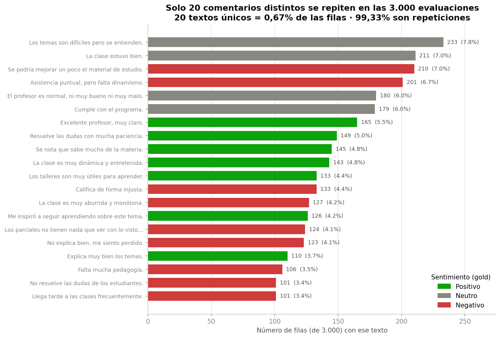

# 🎓 Analítica Educativa — Evaluaciones Docentes


Proyecto capstone del reto **Analítica Educativa** (Samsung Innovation Campus) del equipo
**Tech Tailors**. El objetivo es evolucionar el análisis de evaluaciones docentes de un sistema
basado en reglas hacia uno **predictivo y accionable**, combinando **análisis de sentimiento**
de los comentarios (modelos de lenguaje en español) con un **modelo de clasificación** de la
tendencia de desempeño (`Mejora` / `Estable` / `En riesgo`).

## 📑 Tabla de contenido

1. [Problema y objetivo](#-problema-y-objetivo)
2. [Resultados destacados](#-resultados-destacados)
3. [Estructura del proyecto](#-estructura-del-proyecto)
4. [Instalación](#-instalación)
5. [Orden de ejecución](#-orden-de-ejecución)
6. [Descripción de los notebooks](#-descripción-de-los-notebooks)
7. [Naturaleza y limitaciones de los datos](#-naturaleza-y-limitaciones-de-los-datos)
8. [Créditos](#-créditos)
9. [Guía de aprendizaje](#-guía-de-aprendizaje)
10. [Licencia](#-licencia)

## 🎯 Problema y objetivo

A partir de 3.000 evaluaciones docentes (50 docentes, 7 asignaturas, 8 semestres de 2020 a
2023) con puntajes (claridad, metodología, evaluación), un comentario y una etiqueta de
tendencia, el proyecto busca: (1) **clasificar el sentimiento** de los comentarios con modelos
en español; (2) **caracterizar** los datos (EDA) e identificar las variables más significativas;
y (3) **entrenar y validar** un modelo que anticipe la tendencia de desempeño y sirva de base a
un tablero de priorización de docentes.

## 🏆 Resultados destacados

### Análisis de sentimiento — RoBERTuito es el mejor modelo individual

Se compararon tres modelos en español contra un *gold* etiquetado a mano por rúbrica
(ver [`03_benchmark_modelos.ipynb`](analisis_sentimientos/notebooks/03_benchmark_modelos.ipynb)):

| Modelo | Accuracy | macro-F1 | En comentarios claros |
|---|:--:|:--:|:--:|
| **RoBERTuito** | **0,75** | 0,706 | **0,94** |
| XLM-R (Twitter) | 0,70 | 0,664 | 0,75 |
| BETO | 0,65 | 0,626 | 0,69 |
| Consenso (3 modelos) | 0,75 | **0,730** | 0,81 |

**RoBERTuito** es el mejor modelo individual y sobresale en los comentarios claros (0,94 de
acierto); el **consenso** de los tres da la mejor macro-F1 global (0,730). Los errores se
concentran en comentarios fronterizos (elogios tibios, críticas constructivas).

### Modelo de tendencia — RandomForest calibrado

El [modelo de tendencia](analisis_datos/notebooks/03_modelado_tendencia_docente.ipynb) (campeón
**RandomForest**, con calibración de probabilidades) alcanza **macro-F1 = 0,915** en partición
aleatoria y **0,905** en validación temporal (entrenar 2020–2022, probar 2023), con recall de
`En riesgo` de 0,96 y 0,99 respectivamente.

### El dato clave del texto: solo 20 comentarios distintos

El campo `comentario` repite **20 textos** en las 3.000 filas (0,67 % de unicidad, 99,33 % de
repeticiones). Es una característica del dataset, no un error, y acota el aporte del componente
de texto (detalle en [Naturaleza y limitaciones de los datos](#-naturaleza-y-limitaciones-de-los-datos)).



## 📂 Estructura del proyecto

```
.
├── data/
│   ├── raw/            # dataset original de la universidad (evaluaciones_docentes.csv)
│   └── processed/      # datasets derivados (sentimiento, gold standard, benchmark)
├── analisis_sentimientos/
│   └── notebooks/
│       ├── 01_catalogo_modelos_espanol.ipynb   # catálogo de modelos de sentimiento (referencia)
│       ├── 02_sentimiento_evaluaciones.ipynb   # pipeline de sentimiento → data/processed
│       ├── 03_benchmark_modelos.ipynb          # comparación de los 3 modelos vs gold
│       └── 04_finetuning_sentimiento.ipynb     # fine-tuning (destilación) de BETO — avanzado
├── analisis_datos/
│   ├── notebooks/
│   │   ├── 01_eda_techtailors_referencia.ipynb # EDA de referencia (compañero del equipo)
│   │   ├── 02_integracion_sentimiento_eda.ipynb# integra el sentimiento al EDA
│   │   └── 03_modelado_tendencia_docente.ipynb # entrena, valida y exporta el modelo
│   ├── reports/        # informe de revisión, justificaciones y gráficos
│   └── models/         # artefactos del modelo (.pkl ignorado por git; metadatos versionados)
├── src/                # código reutilizable: rutas.py, sentimiento.py, modelo_utils.py
├── requirements.txt
├── LICENSE
└── README.md
```

## ⚙️ Instalación

```bash
python -m venv .venv && source .venv/bin/activate     # opcional
pip install -r requirements.txt
jupyter lab                                            # o abrir en VS Code
```

Cada notebook contiene una **celda de arranque** que localiza la raíz del repositorio y añade
`src/` al path, por lo que **funcionan desde cualquier carpeta** mientras estén dentro del
proyecto (local o Google Colab, subiendo antes el CSV).

## ▶️ Orden de ejecución

| Paso | Notebook | Qué hace |
|:--:|---|---|
| 1 | `analisis_sentimientos/notebooks/02_sentimiento_evaluaciones.ipynb` | Clasifica el sentimiento y genera los CSV en `data/processed/` |
| 2 | `analisis_sentimientos/notebooks/03_benchmark_modelos.ipynb` | Compara los 3 modelos y recomienda cuál usar |
| 3 | `analisis_datos/notebooks/02_integracion_sentimiento_eda.ipynb` | Integra el sentimiento al análisis de datos |
| 4 | `analisis_datos/notebooks/03_modelado_tendencia_docente.ipynb` | Entrena, valida, calibra y exporta el modelo |

Los notebooks `01_*` son material de referencia/apoyo (catálogo de modelos y EDA del compañero).

## 📓 Descripción de los notebooks

**Análisis de sentimiento** (`analisis_sentimientos/notebooks/`)
- `01_catalogo_modelos_espanol` — catálogo comparativo de modelos de sentimiento en español.
- `02_sentimiento_evaluaciones` — pipeline con 3 modelos + votación por mayoría + *gold standard*.
- `03_benchmark_modelos` — benchmark de los 3 modelos contra el *gold* humano; recomendación.
- `04_finetuning_sentimiento` — **fine-tuning** de BETO por destilación de RoBERTuito sobre
  11.697 comentarios reales balanceados. Documentado académicamente (marco teórico,
  hiperparámetros justificados, curvas de aprendizaje, glosario y referencias). Ejecutable
  en GPU Apple/MPS en ~6 min. Resultado: el ajuste mejora el modelo base (macro-F1 0.626 →
  0.708) e iguala al maestro sin superarlo (0.706), confirmando el límite de la destilación.

**Análisis de datos** (`analisis_datos/notebooks/`)
- `01_eda_techtailors_referencia` — análisis exploratorio (material de referencia del compañero).
- `02_integracion_sentimiento_eda` — integra el sentimiento transformer al EDA y revalida hallazgos.
- `03_modelado_tendencia_docente` — comparación de modelos, validación (aleatoria y temporal),
  calibración y exportación del artefacto de producción.

Informes de apoyo en [`analisis_datos/reports/`](analisis_datos/reports/): revisión del EDA,
justificación de los comentarios repetidos y la sección de limitaciones de datos.

## ⚠️ Naturaleza y limitaciones de los datos

El dataset fue entregado por la universidad y está **anonimizado / plantillado**: el campo
`comentario` proviene de un conjunto fijo de **20 frases** (repetidas en las 3.000 filas), y la
etiqueta `tendencia_desempeno` está derivada por reglas. Implicaciones:

- El **análisis de sentimiento del texto** se evalúa sobre 20 plantillas, por lo que sus
  métricas **validan el método**, no son extrapolables a comentarios de texto libre reales.
- Existe cierta **circularidad** entre la etiqueta y las variables predictoras, por lo que las
  métricas de modelado son un **techo optimista** sobre datos controlados.

Estas limitaciones no comprometen la validez de la metodología, que es aplicable a datos reales.
Detalle completo en
[`analisis_datos/reports/seccion_naturaleza_limitaciones_datos.md`](analisis_datos/reports/seccion_naturaleza_limitaciones_datos.md).

## 👥 Créditos

**Equipo Tech Tailors** — Samsung Innovation Campus, reto Analítica Educativa (Universidad del
Rosario): Juan David Ríos · Natalia Remolina · Giovanni Balza.

El notebook `01_eda_techtailors_referencia.ipynb` es un análisis exploratorio elaborado por un
integrante del equipo; se incluye como referencia y solo se ajustaron sus rutas de datos.

## 📚 Guía de aprendizaje

[`GUIA_APRENDIZAJE.md`](GUIA_APRENDIZAJE.md) explica en lenguaje accesible **qué se hizo, por
qué se decidió cada cosa y qué conceptos hay detrás** (transfer learning, sobreajuste,
macro-F1, destilación). Incluye las decisiones metodológicas con su justificación, preguntas
frecuentes y las líneas de continuación del proyecto. Recomendada para incorporarse al
proyecto o para preparar la exposición ante el jurado.

## 📄 Licencia

Distribuido bajo licencia **MIT**. Ver [`LICENSE`](LICENSE).
